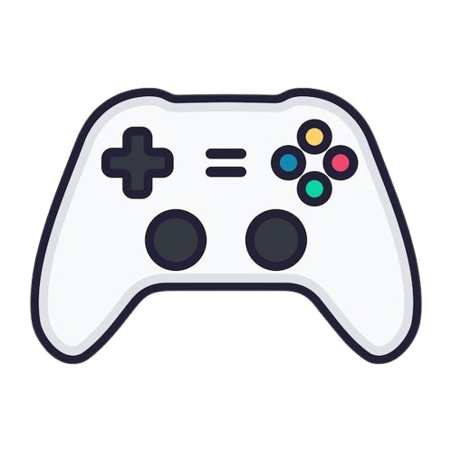

<!-- Banner Section -->
<p align="center">
  
</p>

<h1 align="center">🎮 Python Game - Student Playground</h1>

<p align="center">
  <b>A fun and multi-functional Python desktop app built with Tkinter.</b><br>
  Combining mini-games, study tools, and small utilities into one interactive dashboard.
</p>

<p align="center">
  <!-- Badges -->
  
  
  
  
  
</p>

---

## 🌟 Features

### 🕹️ Games
- Rock Paper Scissors  
- Guess the Number  
- Tic Tac Toe  
- Quiz Game  
- Math Challenge  
- Dice Roller  
- Coin Toss  

### 🧮 Tools
- Calculator  
- Notes Saver  
- Unit Converter  
- Alarm Clock  
- Stopwatch  
- Reminder  
- BMI Calculator  
- Age Calculator  
- Tip Calculator  
- Password Generator  
- Password Strength Checker  
- Currency Converter  
- Calendar  
- Marks Plotter (Graph)  
- Grade Calculator  

---

## 🧠 Technologies Used
- **Python 3.8+**  
- **Tkinter** (GUI Framework)  
- **Matplotlib** (for plotting marks)  
- **NumPy** (for calculations)  
- **Pillow (PIL)** (for handling images)

---

## ⚙️ Installation and Setup

### Step 1: Clone the Repository
```bash
git clone https://github.com/Satyam0202/python_game.git
cd python_game
